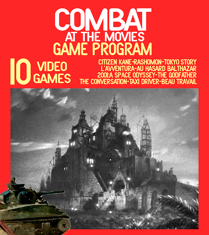
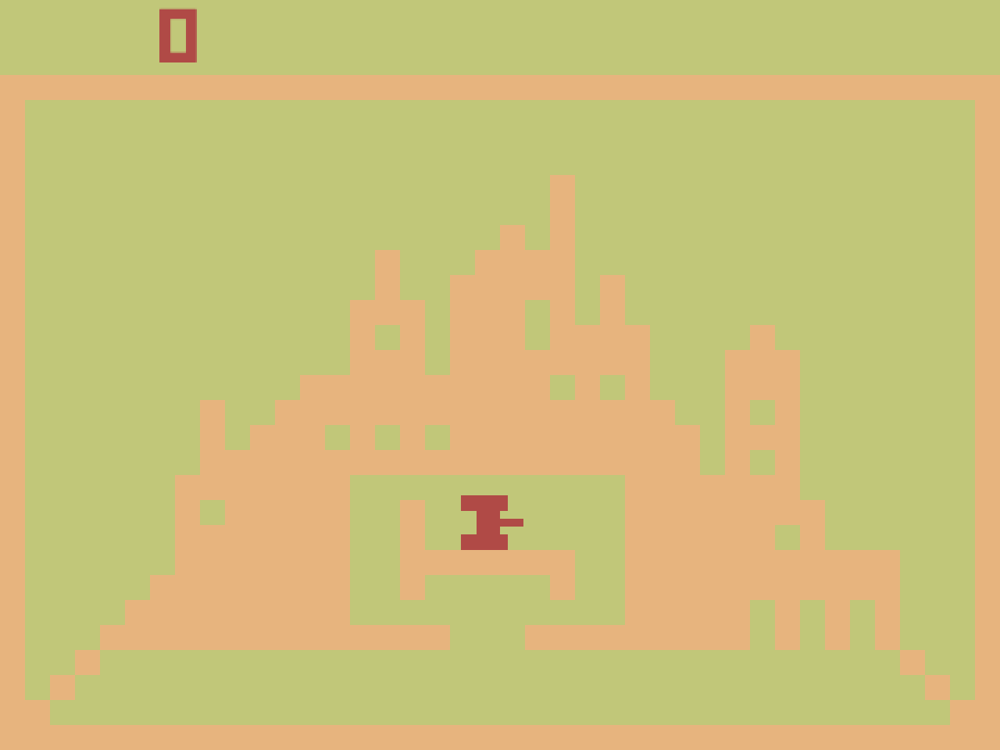
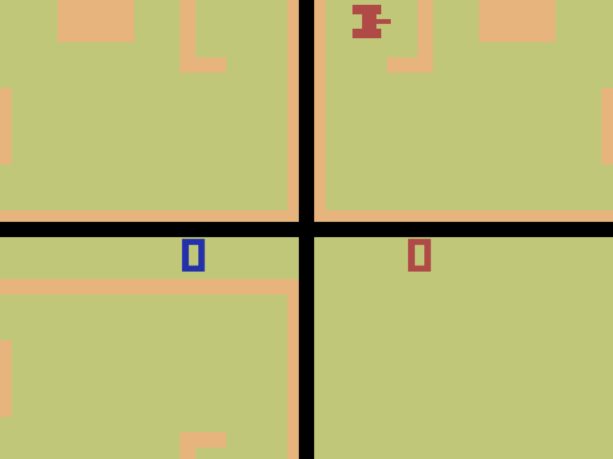
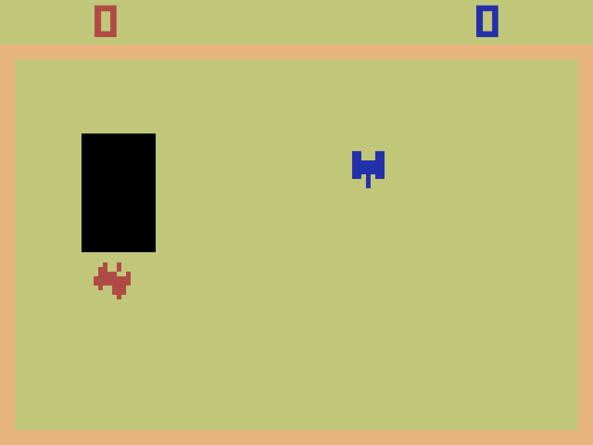
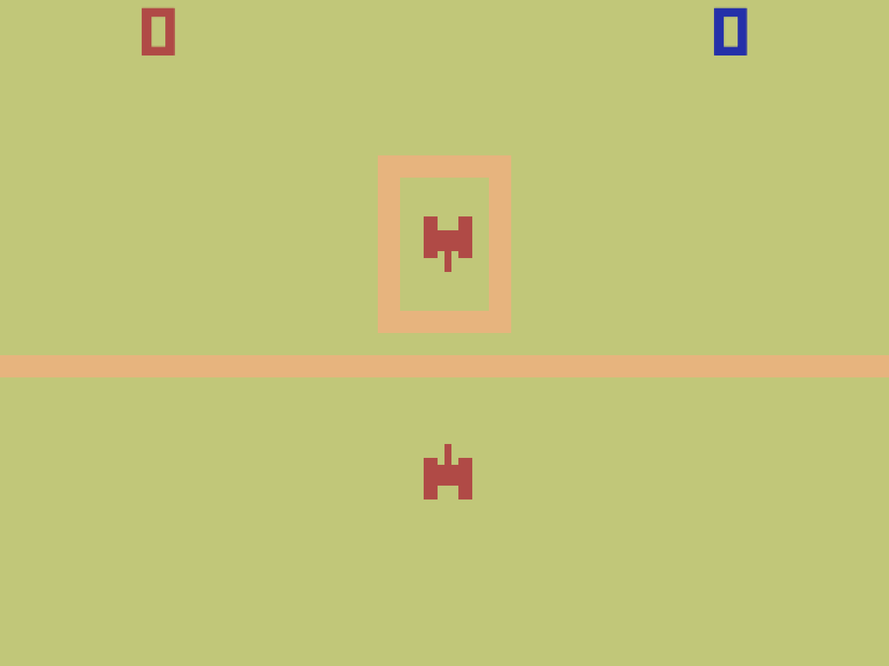

# *Combat at the Movies* Press Kit

*Sure, great works of cinema are great! But aren't they missing something?! Yes! They're missing tanks! Move over Orson Welles! Move over Robert DiNiro! These tanks are ready for their close-up!*

#### [Play *Combat at the Movies*](https://pippinbarr.github.io/combat-at-the-movies) (HTML5, desktop browsers only)

## The basics

* Developer: [Pippin Barr](http://www.pippinbarr.com/)
* Release: 2 December 2020
* Platform: Browser (desktop)
* Code repository: https://github.com/pippinbarr/combat-at-the-movies
* Price: $0.00

## Who is this Pippin Barr guy?

Pippin is an experimental game developer who has made games about everything from [Eurovision](http://www.pippinbarr.com/2012/03/27/epic-sax-game/) to [performance art](http://www.pippinbarr.com/2011/09/14/the-artist-is-present/) to [dystopian post-work futures](http://www.pippinbarr.com/games/2017/07/03/it-is-as-if-you-were-doing-work.html). He's an Assistant Professor in the [Department of Design and Computation Arts](http://www.concordia.ca/finearts/design.html) at [Concordia University](http://www.concordia.ca/) in Montréal. He is also the associate director of the [Technoculture, Art, and Games (TAG)](http://tag.hexagram.ca/) Research Centre, which is part of the [Milieux Institute for Arts, Culture, and Technology](http://milieux.concordia.ca/).

## Description

_Combat at the Movies_ features a selection of 10 films from *Sight & Sound* magazine’s [Critics’ top 100](https://www2.bfi.org.uk/films-tv-people/sightandsoundpoll2012/critics), each adapted into the visuals, sounds, and interactions of Atari's classic tank-fighting game *Combat*. The featured films are Citizen Kane (1941), Rashomon (1950), Tokyo Story (1953), L’Avventura (1960), Au Hasard Balthazar (1966), 2001: A Space Odyssey (1968), The Godfather (1972), The Conversation (1974), Taxi Driver (1976), and Beau Travail (1999). In each case, a scene from the movie has been adapted, experimenting with the question of how (and whether) one can convey some of the same ideas and emotions as a film in the highly limited frame of an Atari 2600-era videogame.

## History

I originally conceived of _Combat at the Movies_ as being a more straightforward sequel to my games *PONGS* and *BREAKSOUT*, that is a series of variations on the classic game *Combat* from Atari. The idea of working on film adaptation as a specific subset of possible variations came thanks to a call for papers for a special issue of the *arts* journal on adaptation in relation to videogames. I thought *Combat* might be an interesting platform to explore this idea of film adaptation in my own way, and so undertook to select fairly well-known "classic movies" to adapt.

The process took an extra long time due to a number of life events and of course the global COVID-19 pandemic. As such, I started all the way back in May 2020, and only really wrapped up the game itself at the end of November 2020. Along with the game and the accompanying documentation, I did indeed write an article for *arts* exploring the design and development process, which you can find here: [Film Adaptation as Experimental Game Design](https://www.mdpi.com/2076-0752/9/4/103).

_Combat at the Movies_ is also another data-point in the ultra-detailed process documentation approach called [Method for Design Materialization (MDM)](http://www.gamesasresearch.com/mdma). So, if you want to, you can read a lot about the game's development by reading its [process documentation](https://github.com/pippinbarr/combat-at-the-movies/blob/master/process/README.md) and by going through its [commit history](https://github.com/pippinbarr/combat-at-the-movies/commits/master).

## Technology

_Combat at the Movies_ was created in JavaScript using the excellent [Phaser 3](http://phaser.io/) game framework. Tilemaps were created in [Tiled](https://www.mapeditor.org/). Sprite atlas was created in [TexturePacker](https://www.codeandweb.com/texturepacker). Sounds were manipulated in [Audacity](https://www.audacityteam.org/).

## License

_Combat at the Movies_ is an open source game licensed under a [Creative Commons Attribution-NonCommercial 3.0 Unported License](http://creativecommons.org/licenses/by-nc/3.0/). You can obtain the source code from its [code repository](https://github.com/pippinbarr/chesses) on GitHub.

## Features

- Dying alone filled with regret!
- Monolith-assisted evolution
- Fruitless searching on an Italian island!
- Disco dancing!
- You Talkin' to Me?!

### [Trailer](https://youtu.be/c99uhqk_7os)

[Trailer on YouTube](https://youtu.be/c99uhqk_7os)

## Images

*Title screen*

  
*Citizen Kane*

  
*Rashomon*

  
*2001: A Space Odyssey*

  
*Taxi Driver*

## Press

Coming soon?

## Additional Links

- [Process documentation of _Combat at the Movies_](https://github.com/pippinbarr/combat-at-the-movies/blob/master/process/README.md)
- [Commit history of _Combat at the Movies_](https://github.com/pippinbarr/combat-at-the-movies/commits/master)
- Barr, P. [Film Adaptation as Experimental Game Design](https://www.mdpi.com/2076-0752/9/4/103). *Arts* 9:4. 2020. https://doi.org/10.3390/arts9040103

## Credits

* Pippin Barr: design and implementation
* Tank sound effects from Atari's *Combat*

## Contact

* Email: [pippin.barr+press@gmail.com](mailto:pippin.barr+press@gmail.com)
* Website: [www.pippinbarr.com](http://www.pippinbarr.com/)
* Twitter: [@pippinbarr](https://www.twitter.com/pippinbarr)
* Instagram: [@pippinbarr](https://www.instagram.com/pippinbarr)
* Facebook: [Pippin Barr](http://www.facebook.com/pippin.barr)
